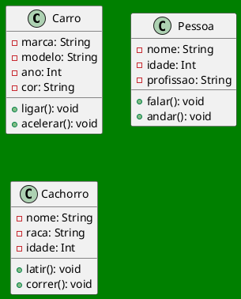

# Programação Orientada a Objetos

Classes


**Leandro Souza**

---
hideInToc: true
---

## Agenda

<Toc />


---
layout: image-right
image: ./img/Slide01.png
backgroundSize: 120%
backgroundPosition: center
class: text-2xl 
---

## A Jornada do Programador Criador

  - Do caos do código procedural à ordem do universo de objetos.
  - *Definindo as Leis do Cosmos*: 
    - O que é Programação Orientada a Objetos?
  - *O Poder da Abstração*: 
    - Como modelar o mundo real dentro da máquina.

---
layout: quote
color: sky-light
class: text-2xl 
--- 

Compreender que programar não é apenas escrever linhas, é criar sistemas vivos e organizados


---
class: text-2xl 
--- 

## O Caos vs. A Ordem

- A Crise do Software:
  - Por que a programação linear (procedural) se torna confusa em grandes projetos?

- A Grande Mudança de Perspectiva:
  - Parar de pensar em "passos de uma receita" e começar a pensar em "seres e comportamentos"

- O que é um Paradigma?
  - Entendendo a POO como uma nova lente para enxergar e resolver problemas.


---
layout: image-right
image: ./img/Slide02.png
backgroundSize: 120%
backgroundPosition: center
class: text-2xl 
---

- O Mundo é Feito de Objetos:
  - Como o cérebro humano já organiza naturalmente a realidade em categorias e entidades.

- Promessa da POO:
  - Organização, reutilização e facilidade de manutenção.


---
layout: image

# the image source
image: ./img/caus.png
---

---
layout: image

# the image source
image: ./img/class.png
---


---
layout: image-right
image: ./img/Slide03.png
backgroundSize: 90%
class: text-2xl 
---

## Modelando a Realidade

- A Analogia dos Objetos: 
  - Como percebemos o mundo através de entidades (carro, pessoa, conta bancária).
- Estado e Comportamento:  
  - Atributos: As características (o que o objeto _tem_).
  - Métodos: As ações (o que o objeto _faz_).

---
layout: two-cols-header
class: text-xl 
hideInToc: true
---

## Modelando a Realidade

:: left :: 

- Identidade Única: 
  - Por que cada objeto, mesmo sendo do mesmo tipo, é um indivíduo diferente no sistema.
- O Programador como Arquiteto: 
  - A arte de traduzir necessidades do mundo real em modelos digitais.
- Simplicidade na Complexidade: 
  - Como quebrar um problema grande em pequenos objetos autônomos.

:: right ::


<Transform :scale="1.3">




</Transform>


---
layout: image-right
image: ./img/Slide04.png
backgroundSize: 90%
class: text-xl 
---

## A Anatomia de uma Classe


- O Projeto Original: 
  - Entendendo a classe como o "plano de construção" ou o "DNA" do objeto.
- Atributos (Campos): 
  - Onde armazenamos os dados e o estado do objeto.
- Métodos (Funções): 
  - A lógica que define as habilidades e comportamentos.


---
class: text-3xl 
---

## Exercício de modelagem

1.  Crie uma descrição do que deve ser um "Carro" dentro no seu universo.

Um Carro <span v-click> _TEM_ ... (atributos/substantivos) ... </span> <span v-click>e _FAZ_ ... (métodos/verbos) ... </span>

---
class: text-2xl 
transition: slide-up
level: 2
---

## Encapsulamento Inicial
  - Como a classe agrupa dados e comportamentos em uma única unidade?
<Transform :scale="1.8">

```java{none|1|2-4|5-10|all}{at:1}
class Cachorro {
  String nome;
  String raca;
  int idade;
  void latir() {
    // lógica para o cachorro latir
  }
  void correr() {
    // lógica para o cachorro correr
  }
}
```
</Transform>

<Arrow v-click="[6, 7]" x1="340" y1="110" x2="240" y2="210" />
<Arrow v-click="[6, 7]" x1="340" y1="145" x2="240" y2="245" />
<Arrow v-click="[6, 7]" x1="340" y1="170" x2="220" y2="290" />

<Arrow v-click="[7, 8]" x1="370" y1="200" x2="270" y2="300" />
<Arrow v-click="[7, 8]" x1="370" y1="300" x2="270" y2="400" />


---
class: text-xl 
hideInToc: true
---

## Encapsulamento Inicial


<Transform :scale="2">

```java{none|1|2-5|6-11|all}{at:1}
class Carro {
  String marca;
  String modelo;
  int ano;
  String cor;
  void ligar() {
    // lógica para ligar o carro
  }
  void acelerar() {
    // lógica para acelerar o carro
  }
}
```
</Transform>

---
class: text-xl 
---

## Abstração


> A arte de simplificar a realidade para focar no que importa.


- Filtragem de Detalhes: Ignorar o irrelevante para reduzir a carga cognitiva e a complexidade do código.
- O Modelo Essencial: Representar apenas as características necessárias para o contexto do problema.
- Redução de Ruído: Como evitar que o excesso de informação prejudique a lógica do sistema.

