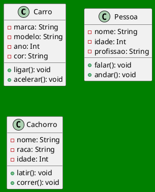

# Programação Orientada a Objetos

Classes


**Leandro Souza**

---
hideInToc: true
---

## Agenda

<Toc columns="2" />


---
layout: image-right
image: ./img/Slide01.png
backgroundSize: 120%
backgroundPosition: center
class: text-2xl 
---

## A Jornada do Programador Criador

  - Do caos do código procedural à ordem do universo de objetos.
  - *Definindo as Leis do Cosmos*: 
    - O que é Programação Orientada a Objetos?
  - *O Poder da Abstração*: 
    - Como modelar o mundo real dentro da máquina.

---
layout: quote
color: green-light
class: text-2xl 
--- 

Compreender que programar não é apenas escrever linhas, é criar sistemas vivos e organizados


---
class: text-2xl 
--- 

## O Caos vs. A Ordem

- A Crise do Software:
  - Por que a programação linear (procedural) se torna confusa em grandes projetos?

- A Grande Mudança de Perspectiva:
  - Parar de pensar em "passos de uma receita" e começar a pensar em "seres e comportamentos"

- O que é um Paradigma?
  - Entendendo a POO como uma nova lente para enxergar e resolver problemas.


---
layout: image-right
image: ./img/Slide02.png
backgroundSize: 120%
backgroundPosition: center
class: text-2xl 
---

- O Mundo é Feito de Objetos:
  - Como o cérebro humano já organiza naturalmente a realidade em categorias e entidades.

- Promessa da POO:
  - Organização, reutilização e facilidade de manutenção.


---
layout: image

# the image source
image: ./img/caus.png
---

---
layout: image

# the image source
image: ./img/class.png
---


---
layout: image-right
image: ./img/Slide03.png
backgroundSize: 90%
class: text-2xl 
---

## Modelando a Realidade

- A Analogia dos Objetos: 
  - Como percebemos o mundo através de entidades (carro, pessoa, conta bancária).
- Estado e Comportamento:  
  - Atributos: As características (o que o objeto _tem_).
  - Métodos: As ações (o que o objeto _faz_).

---
layout: two-cols-header
class: text-xl
hideInToc: true
---

## Modelando a Realidade

:: left :: 

- Identidade Única: 
  - Por que cada objeto, mesmo sendo do mesmo tipo, é um indivíduo diferente no sistema.
- O Programador como Arquiteto : 
  - A arte de traduzir necessidades do mundo real em modelos digitais.
- Simplicidade na Complexidade: 
  - Como quebrar um problema grande em pequenos objetos autônomos.

:: right ::


<Transform :scale="1.3">




</Transform>

---
layout: image-right
image: ./img/Slide04.png
backgroundSize: 90%
class: text-xl
---

## A Anatomia de uma Classe


- O Projeto Original: 
  - Entendendo a classe como o "plano de construção" ou o "DNA" do objeto.
- Atributos (Campos): 
  - Onde armazenamos os dados e o estado do objeto.
- Métodos (Funções): 
  - A lógica que define as habilidades e comportamentos.

---
class: text-3xl
---

## Exercício de modelagem

1.  Crie uma descrição do que deve ser um "Carro" dentro do seu universo.

Um Carro <span v-click> _TEM_ ... (atributos/substantivos) ... </span> <span v-click>e _FAZ_ ... (métodos/verbos) ... </span>

---
class: text-2xl
transition: slide-up
---

## Encapsulamento Inicial
  - Como a classe agrupa seus dados e comportamentos em uma única unidade?
<Transform :scale="1.8">

```java{none|1|2-4|5-10|all}{at:1}
class Cachorro {
  String nome;
  String raca;
  int idade;
  void latir() {
    // lógica para o cachorro latir
  }
  void correr() {
    // lógica para o cachorro correr
  }
}
```
</Transform>

<Arrow v-click="[6, 7]" x1="340" y1="110" x2="240" y2="210" />
<Arrow v-click="[6, 7]" x1="340" y1="145" x2="240" y2="245" />
<Arrow v-click="[6, 7]" x1="340" y1="170" x2="220" y2="290" />

<Arrow v-click="[7, 8]" x1="370" y1="200" x2="270" y2="300" />
<Arrow v-click="[7, 8]" x1="370" y1="300" x2="270" y2="400" />

---
class: text-xl 
hideInToc: true
---

## Encapsulamento Inicial


<Transform :scale="2">

```java{none|1|2-5|6-11|all}{at:1}
class Carro {
  String marca;
  String modelo;
  int ano;
  String cor;
  void ligar() {
    // lógica para ligar o carro
  }
  void acelerar() {
    // lógica para acelerar o carro
  }
}
```
</Transform>

---
layout: quote
color: green-light
class: text-2xl
transition: slide-up
---

## Abstração


A arte de simplificar a realidade para você focar no que importa.

---
layout: image-right
image: ./img/abstracao.png
backgroundSize: 110%
class: text-xl
hideInToc: true
transition: slide-up
---

## Abstração

<Admonition title="Filtragem de Detalhes" customTitle="text-2xl" custom="text-xl" color="teal-light">

Ignorar o irrelevante para reduzir a carga cognitiva e a complexidade do código.
</Admonition>

- O Modelo Essencial
  - Representar apenas as características necessárias para o contexto do problema.
- Redução de Ruído
  - Como evitar que o excesso de informação prejudique a lógica do sistema.


---
layout: image-right
image: ./img/paciente.png
backgroundSize: 110%
class: text-xl
hideInToc: true
transition: slide-up
---

## Abstração

<Admonition title="A Lente do Contexto" customTitle="text-2xl" custom="text-xl" color="teal-light">
O que é essencial em um sistema pode ser irrelevante em outro
</Admonition>

Exemplo do Pessoa sendo modelada em dois contextos diferentes:

- No Sistema Hospitalar
  - Focamos em `tipoSanguineo`, `historicoMedico` e `alergias`.

- No Sistema de uma Loja de Discos
  - O mesmo paciente (agora um cliente) seria modelado por `estiloMusical` e `albunsFavoritos`.


---
layout: image-right
image: ./img/balada.png
backgroundSize: 110%
class: text-xl
transition: slide-up
---

## O Contexto 

- A Relevância do Dado
  - Em um sistema de controle de acesso (portaria), o único atributo que define se o objeto pode ou não executar o método `entrar()` é a `idade`.
- Descarte de Informação
  - Para o segurança (o sistema), não importa o `tipoSanguineo` ou `historicoMedico` do cliente. Ter esses dados aqui seria um desperdício de memória e complexidade.

---
class: text-2xl
transition: slide-up
---

## Foco no Comportamento

<Admonition title="" icon="" custom="text-2xl" color="teal-light">

A abstração permite que o sistema tome decisões rápidas focando apenas nas propriedades que afetam a regra de negócio atual.

</Admonition>


- Objeto do mundo real único, Múltiplas Visões
  - Entendendo que um "Cliente" em uma balada é uma abstração diferente de um "Paciente" em um hospital, mesmo que ambos representem a mesma pessoa física.

---
layout: quote
color: green-light
class: text-2xl 
hideInToc: true
transition: slide-up
---

## Abstração
Abstrair é saber o que ignorar


---
layout: image-right
image: ./img/esculpir.png
backgroundSize: 110%
class: text-xl
---

##  Modelagem Consciente


<Admonition custom="text-2xl" title="" icon="" color="yellow-light">

Escolher os atributos certos não é apenas sobre técnica, é sobre entender profundamente o negócio.

</Admonition>

-  Um "universo estável" (sistema) depende de modelos que reflitam a realidade de forma equilibrada - nem complexos demais, nem simples ao extremo.

- Transformar requisitos abstratos em estruturas concretas, elegantes e funcionais.


---
class: text-xl
---

## Atributos (ter) e Métodos (fazer).

::div{.grid.items-center.h-full}
  :::div
  <Admonition title="O que a criatura TEM" customTitle="text-2xl h-full" custom="text-xl " color="teal-light">
  
  
  Variáveis de instância definem o estado do objeto

  </Admonition>
  :::
::

--- 
layout: image-right
image: ./img/Slide21.png
backgroundSize: 110%
class: text-xl
---


## Atributos - O DNA do Objeto

- Definição de Atributo: São as características ou propriedades que descrevem o objeto.
- Variáveis de Instância: Por que cada objeto guarda sua própria cópia dessas informações.
- O Estado do Ser: Como o conjunto de atributos define quem o objeto é naquele momento.
- Exemplos práticos: `corDoOlho`, `altura`, `nome`.

---
class: text-xl
layout: image-right
image: ./img/Slide22.png
backgroundSize: 110%
---

## Tipos Primitivos - Partículas Elementares

- A Matéria Bruta: Tipos básicos que guardam valores simples (números, letras, sim/não).
- Os Mais Usados: `int` (inteiros), `double` (decimais), `boolean` (lógica) e `char` (caracter), `String` (caracteres).
- Eficiência: Ocupam pouco espaço e são a base de qualquer estrutura complexa.


---
class: text-2xl
layout: image-right
image: ./img/Slide24.png
backgroundSize: 110%
---


## Métodos - Ação e Transformação

- O "Verbo" do Código: Métodos definem os comportamentos e as habilidades do objeto.
- Lógica Encapsulada: Onde o processamento acontece de verdade.
- Interação: Como o mundo externo solicita que o objeto faça algo.


---
class: text-xl
layout: image-right
image: ./img/Slide25.png
backgroundSize: 110%
---

## Assinatura de Métodos - Verbos e Poderes

- Nome do Método: A escolha de nomes que indicam ação (`correr()`, `salvar()`, `calcular()`).
- Parâmetros: As informações extras que o método precisa para funcionar (ex: `acelerar(int intensidade)`).
- Retorno: O resultado que o método devolve após processar a informação.


---
class: text-2xl
layout: image-right
image: ./img/Slide26.png
backgroundSize: 110%
---

## Mutação - Mudando o Estado

  - Um método pode ler e alterar os atributos do próprio objeto.
    - Exemplo do `idade++` ou `subirNivel()` - a ação transformando o estado do objeto

---
class: text-2xl
layout: image-right
image: ./img/Slide27.png
backgroundSize: 110%
---

## Mensagens - O Ato da Invocação

- Sintaxe de Chamada: Entendendo o `objeto.metodo()`.
- Comunicação entre Objetos: Na POO, o sistema funciona através de objetos enviando mensagens uns aos outros.
- A Reação: O que acontece quando você "chama" um comportamento.

---
class: text-2xl
layout: image-right
image: ./img/Slide28.png
backgroundSize: 110%
---


## Efeito Colateral - O Antes e Depois

- Rastreabilidade: Observando a mudança de valores nos atributos após uma execução.
- Regras de Negócio: Um método `sacar()` que só funciona se o atributo `saldo` for suficiente.
- A Magia da Execução: O código em movimento transformando dados estáticos.

---
class: text-xl
layout: image-right
image: ./img/Slide29.png
backgroundSize: 110%
---


## O RPG da Programação

- Analogia Prática: Atributos são a ficha do personagem; Métodos são as habilidades especiais.
- Status: `HP`, `MP`, `Level` (Atributos).
- Skills: `atacar()`, `usarItem()`, `defender()` (Métodos).
- Visão de Jogo: Como enxergar qualquer sistema como um grande tabuleiro interativo.

---
class: text-3xl
---

## Revisão - Ter vs. Fazer

- Síntese do Objeto: Objeto = Dados (Atributos) + Comportamento (Métodos).
- Coesão: Por que é importante manter dados e ações juntos na mesma classe.
- Conclusão do Ato: Sem atributos, o objeto é vazio; sem métodos, o objeto é inerte.


---
class: text-3xl
---

## Exercicio


[https://classroom.github.com/a/dwIOoObi](https://classroom.github.com/a/dwIOoObi)